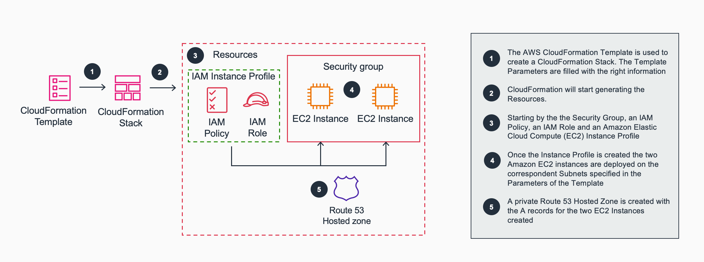
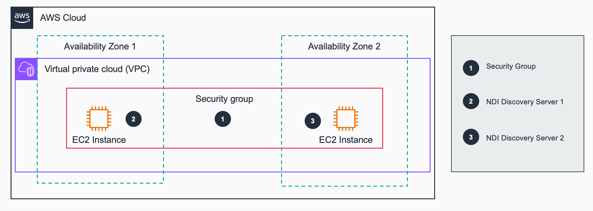
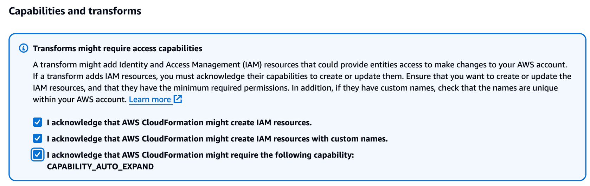
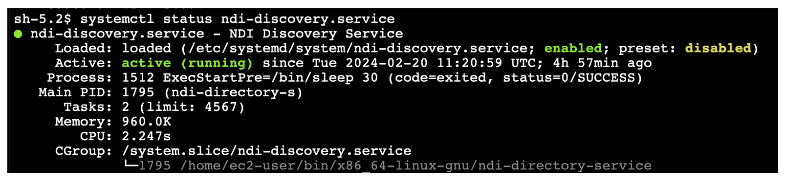

# Guidance for programatic deployment of NDI Discovery Servers for Broadcast workflows on AWS

## Table of Content

1. [Overview](#overview)
    - [Architecture](#Architecture)
    - [Cost](#cost)
2. [Prerequisites](#prerequisites)
    - [Operating System](#operating-system)
3. [Deployment Steps](#deployment-steps)
4. [Deployment Validation](#deployment-validation)
5. [Running the Guidance](#running-the-guidance)
6. [Next Steps](#next-steps)
7. [Cleanup](#cleanup)
8. [Notices](#notices)
10. [Additional Resources](#resources)
10. [Authors](#authors)

## Overview 

This sample, non-production-ready template describes a CloudFormation template to deploy the NDI DIscovery Servers on an existing VPC.

This pattern is designed for broadcasters requiring swift provisioning and dismantling of NDI environments for live production setups, utilizing the elasticity and flexibility of AWS infrastructure.

AWS provides services that enable the creation, deployment and maintenance of infrastructure in a programmatic, descriptive, and declarative way and these services provide rigor, clarity, and reliability. AWS CloudFormation enables developers to create AWS resources in an orderly and predictable fashion. Resources are written in template files using JSON or YAML format. Then, CloudFormation reads the template and generates the stacks, that are deployed in a safe, repeatable manner.

NDI is a royalty-free protocol developed by NewTek (Vizrt) to enable video-compatible products to share video across a local area network (LAN). The NDI discovery service is designed to allow you to replace the automatic discovery NDI uses with a server that operates as a centralized registry of NDI sources.

This pattern provides a method to deploy the NDI Discovery Servers through a CloudFormation template presenting the required information for the deployment as input parameters on the template.

We have chosen CloudFormation as the method of deployment over alternative approaches (like CDK) because it is the simplest level of abstraction of Infrastructure as a Code. It’s console driven and it handles the end to end life cycle: creating, updating and deleting the stack which you wouldn’t get from a Python or a CLI script. And last it leaves a visual point of reference in the console itself.

When you launch an instance in Amazon EC2, you have the option of passing "User Data" to the instance that can be used to perform common automated configuration tasks and even run scripts after the instance starts. We are using the CloudFormation helper script cfn-init to install the NDI packages and start the "ndi-discovery" service. After this process we communicate back to CloudFormation the success of the installation using the cfn-signal helper script to finilise the deployment of the Stack.  

The Instance Profile role associated to the EC2 instances have an AWS managed policy attached: "AmazonSSMManagedEC2InstanceDefaultPolicy". This allows AWS Systems Manager to manage your Amazon EC2 instances automatically as managed instances. The benefits of managing your instances with Systems Manager include the following:

* Connect to your EC2 instances securely using Session Manager.
* Perform automated patch scans using Patch Manager.
* View detailed information about your instances using Systems Manager Inventory.
* Track and manage instances using Fleet Manager.
* Keep SSM Agent up to date automatically.

The target audience includes **Broadcast** engineers or individuals with minimal AWS experience, as the template reduces the need for coding or scripting expertise. This template doesn't require any packaging process (upload local artifcats to an S3 bucket) and the CloudFormation template can easily be re-used and customized for various live production deployments.

## Architecture

### CloudFormation Deployment:



Target technology stack:

   * An Instance Profile 
       - An IAM Policy
       - An IAM Role 
   * A Security Group 
   * One or two EC2 instances
   * A Route 53 hosted zone with the one or two A records  

### Deployed Resources:




## Cost

You are responsible for the cost of the AWS services used while running this Guidance. As of Mars 2024, the cost for running this Guidance with the default settings in the US East (N. Virginia) is approximately $31.01 per month (on-demand) for each NDI Discovery Server (based on the t3.medium EC2 instances type) 

## Prerequisites

This AWS CloudFormation template will create an IAM Policy and an IAM Role that will be associated with the Instance Profile of the EC2 instances deployed. It also creates a Security Group associated to the instances. Last it also creates a Route 53 hosted zone and one A records per Instance. For that reason the credentials used when creating the CloudFormation stack will need to have sufficient privileges to create those resources.

The EC2 instances will download the sofwtare from a public repository fron NDI (downloads.ndi.tv), that means that the EC2 instances needs to be able to connect to the Internet to access the files, either asigning a public IP and using an Internet Gateway or a NAT Gateway if the instances are deployed in private subnets. 

Once deployed and as the EC2 instances are not launched with a Key Pair, Systems Manager is used to connect to them in case it's needed. This will require that the EC2 instances will be placed on a public subnet (using a public IP and the Internet Gateway) or in case the instances are deployed on private subnets then a NAT gateway or VPC endpoints are required to connect to the instances. 

### Operating System

The EC2 instances deployed will use the latest **<Amazon Linux 2023 >** AMI available in the region selected for deployment.

### Third-party tools

The EC2 instances will download and install the NDI SDK for Linux from the url: https://downloads.ndi.tv/SDK/NDI_SDK_Linux/Install_NDI_SDK_v5_Linux.tar.gz

### AWS account requirements

This deployment requires you have the policies needed to deploy the resources deployed by CloudFormation.
This deployemnt requires an exisiting VPC with at less one Subnet to deploy the EC2 instance to host the Discovery Server (two Subnets if a redundant cofiguration is used)

## Deployment Steps

1. Clone the repo using command ```git clone aws-solutions-library-samples/guidance-for-programatic-deployment-of-NDI-Discovery-Servers```
2. cd to the repo folder ```cd <guidance-for-programatic-deployment-of-NDI-Discovery-Servers>```
3. Navigate to the deployment folder and download the CloudFormation template: "ec2-ndi-discovery-servers-deployment-template.yml
4. Navigate to the CloudFormation console or use CLI and deploy the template either by manually upload it to an Amazon S3 bucket or if the template was uploaded before select the 'Amazon S3 URL'. 
5. Fill up the parameters of the template
6. Acknoledge the CloudFormation needed capabilities:



7. Wait until CloudFormation finishes deploying the different resources. Once deployed you can navigate to the outputs section and note down the private DNS names of the NDI Discovery Servers

Please be aware that "termination protection" is enabled on the EC2 instances, if you want to delete the Stack you will need to disable the termination protection on the EC2 instances first.

## Deployment Validation 


* On the CloudFormation console the Stack status should be "_**CREATE_COMPLETE**_" 
* If deployment is successful, you should be able to see one Instance per Subnet selected in the Resources tab, Type: "AWS::EC2::Instance"
* You can click on each of the Instances and connect to it using SSM, select the Instance and hit "Connect" (You may need to wait few minutes until the Instances is available). Once connected with Session Manager run the following command: ``` systemctl status ndi-discovery.service ```. You should see an answer from the service being active (running): 




## Running the Guidance

This CloudFormation Template is built using parameters, please add the desired values for the different parameters:

Instance Configuration:

* InstanceName: the name that will be given to the EC2 instances, followed by the subnet where the Instance is deployed. 
* VolumeSize: the size of the EBS volume for the EC2 instances
* InstanceType: type of the EC2 instances to be used for the deployment, there are two pre define values, if a different type is needed select "_other_"
* InstanceTypeManual: in case a differnt type of EC2 instances is needed please set it up here.
* AmiID: this parameter is populated by default with the value of the latest Linux2 AMI on the region, if an especific AMI is required this parameter could be modified.

VPC Configuration:

* VpcId: the ID of the VPC where the Discovery Servers EC2 instances will be deployed. This information is used on the Security Group created by the template associated to the EC2 instances.
* VpcCidr: this is the CIDR of the VPC where the discovery servers EC2 instances will be deployed, this information is used on the Security Group to specify the IP's allowed to communicate with the discovery servers  
* SubnetIds: List of subnets to deploy to. An NDI discovery server will be deployed to each selected subnet. It is recommended to deploy two discovery servers placed in two different subnets for resilience.

Domain Settings:

* PrivateDnsName: name of the private domain to use for the NDI Discovery Servers endpoints. A new hosted zone will be created.

Business Tags:

* Owner: this is a TAG that will be associated with the EC2 instances representing the Owner, it's not mandatory but it's best practises to follow a TAG policy when deploying resources on AWS.


## Next Steps

Once the Discovery Servers are deployed and are up and running you can use them to register your NDI sources. If you are using the NDI Tools you can set up the discovery servers under the _Access Manager: Advance Configuration_.

Remember that NDI uses different protocols and ports for the NDI streams themselves, refer to the NDI Networking best practises to understand the allocation and create the Security Group for the NDI sender and receivers EC2 instances.     

## Cleanup

You can clean up all the resources deployed by simply deleteing the CloudFormation Stack. But as the option "termination protection" is enabled you will need to disable it before deleting the Stack. You can simply access each of the EC2 instances from the console and disable this option: "change termination protection"

## Notices 

*Customers are responsible for making their own independent assessment of the information in this Guidance. This Guidance: (a) is for informational purposes only, (b) represents AWS current product offerings and practices, which are subject to change without notice, and (c) does not create any commitments or assurances from AWS and its affiliates, suppliers or licensors. AWS products or services are provided “as is” without warranties, representations, or conditions of any kind, whether express or implied. AWS responsibilities and liabilities to its customers are controlled by AWS agreements, and this Guidance is not part of, nor does it modify, any agreement between AWS and its customers.*

## Additional Resources

AWS Introduction to DevOps Whitepaper:  Infrastructure as Code https://docs.aws.amazon.com/whitepapers/latest/introduction-devops-aws/infrastructure-as-code.html

CloudFormation deployment: https://docs.aws.amazon.com/cli/latest/reference/cloudformation/deploy/index.html

CloudFormation getting started: https://docs.aws.amazon.com/AWSCloudFormation/latest/UserGuide/GettingStarted.html

EC2 User Data: https://docs.aws.amazon.com/AWSEC2/latest/UserGuide/user-data.html

CloudFormation Metadata Init: https://docs.aws.amazon.com/AWSCloudFormation/latest/UserGuide/aws-resource-init.html

CloudFormation cfn-init helper script: https://docs.aws.amazon.com/AWSCloudFormation/latest/UserGuide/cfn-init.html

CloudFormation Intrinsic Function: ForEach: https://docs.aws.amazon.com/AWSCloudFormation/latest/UserGuide/intrinsic-function-reference-foreach.html

Amazon SSM Managed EC2 instance Default Policy: https://docs.aws.amazon.com/aws-managed-policy/latest/reference/AmazonSSMManagedEC2InstanceDefaultPolicy.html

Connect to an EC2 instance using SSM and VPC endpoints: https://docs.aws.amazon.com/prescriptive-guidance/latest/patterns/connect-to-an-amazon-ec2-instance-by-using-session-manager.html

Self Guided Workshop: https://catalog.us-east-1.prod.workshops.aws/workshops/e00c206d-b923-4ba6-9887-6d93d1cc39ca/en-US

NDI Netwroking best practises: https://go.ndi.tv/NDI_NetworkingBestPractices 

## Authors

- Andrew Lee, Sr Media Cloud Architect AWS
- Manuel González, Principal Solutions Architect AWS
